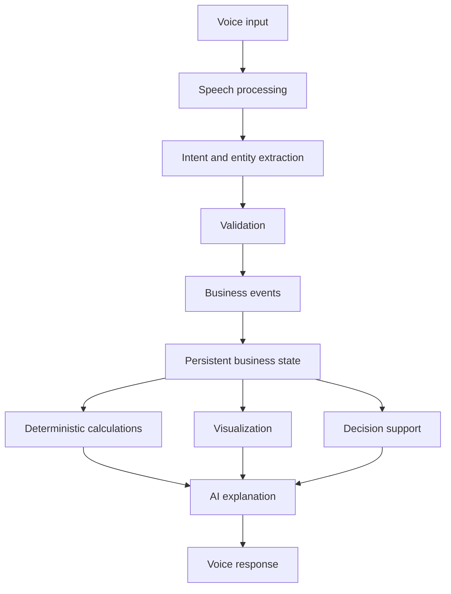

# Architecture

This document describes the **planned** architecture. It is conceptual. Domain types listed here are not implemented as a schema or API yet.

## Architectural principle

**The LLM is not the source of truth for business numbers.**

- The **database / business-state layer** is authoritative.
- **Deterministic calculations** produce metrics from that state.
- The **AI layer** interprets natural language (speech or text) and explains results that were computed from state.
- Voice is an interface. It does not store balances.

If speech is ambiguous, the system should validate or ask before mutating state. A fluent but ungrounded number from a model is an error, not a feature.

## Conceptual pipeline



Linear reading of the same pipeline:

Voice input → Speech processing → Intent / entity extraction → Validation → Business events → Persistent business state → Deterministic calculations, visualization, and decision support → AI explanation → Voice response.

### Stage notes

| Stage | Planned responsibility |
| --- | --- |
| Voice input | Capture utterance from the owner. |
| Speech processing | Speech-to-text (and later, text-to-speech for replies). |
| Intent / entity extraction | AI maps language to a candidate event or query (sale, expense, stock in, payment, “what does Amina owe?”). |
| Validation | Check required fields, known products/customers, quantities, and contradictions against current state. Reject or clarify before commit. |
| Business events | Append-only (or similarly auditable) typed records of what was accepted. |
| Persistent business state | Derived and stored view: catalog, stock, customer balances, cash-relevant totals as defined by rules. |
| Deterministic calculations | Sums, remaining stock, receivables, period totals — from events/state, not from prose. |
| Visualization | Charts and summaries bound to calculated metrics. |
| Decision support | Suggestions grounded in those metrics (for example, restock or collect a debt), still not free-invented figures. |
| AI explanation | Natural-language (and spoken) explanation of the computed result. |
| Voice response | Spoken reply to the owner. |

Speech processing, extraction, persistence, and UI are all future work. Hackathon voice infrastructure (for example Voxide) is expected to sit at the voice input / speech processing / voice response edges; it is not wired in this milestone.

## Planned domain concepts

These are architectural names only:

- **Product** — an item or service the business sells or stocks.
- **Customer** — a person or account that can buy, owe, or pay.
- **Transaction** — a grouping or umbrella for related money/stock movements if needed.
- **Sale** — goods or services provided, possibly cash, mobile money, or credit.
- **Expense** — money leaving the business for operating costs.
- **Purchase** — acquiring stock or materials.
- **Payment** — money received or made against a sale, purchase, or debt.
- **Inventory movement** — change in on-hand quantity (sale, restock, adjustment).
- **Receivable** — amount a customer still owes.

Events should update state through explicit rules (for example, a credit sale increases a receivable and decreases inventory; a payment decreases that receivable). The rules belong in application code, not in prompt text.

## Source of truth

```text
speech  →  candidate event/query  →  validation  →  event log
                                              ↓
                                     business state  →  calculations  →  UI / spoken explanation
```

Transcripts may be stored for debugging. They are not the ledger.

## Non-goals at this stage

- Full database schema
- Authentication
- Payment processing
- Live voice integration
- Dashboard implementation
- Training or fine-tuning a model to “know” the books
